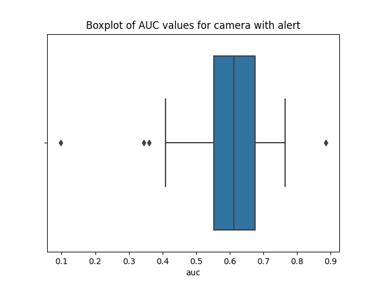

# Data Science technical test

Welcome to [Veesion](https://veesion.io/)'s Data Science technical test!
Thank you for investing your time in this assignment.

[Veesion](https://veesion.io/) uses cutting edge video deep learning to automatically detect suspicious gestures in retail stores. This test will guide you in exploring the metadata associated with our models' alerts.

## Instructions

This test is designed for experienced Data Scientists and should be done in approximately 3 hours.
An extensive additional time investment will **not** be valued.

The expected language is **Python**.

We aim at evaluating skills such as:
- Data exploration
- Data analysis
- Problem solving
- Python development

Feel free to respond to the questions in whatever way you deem appropriate.

We expect you to return a .zip self-contained file including everything you consider necessary for:
- Reviewing your response to the questions
- **Reproducing your results**

## Data context

In production, a deep learning model generated alerts for what it considered to be thefts. 

The metadata of the alerts are stored in the CSV named in `data/production_alerts_meta_data.csv`:
- The store column contains the name of the store,
- The video_name column contains the name of the video file which constitutes the alert. This name is composed as follows: `{START_TIME}_to_{END_TIME}_camera_{CAMERA_ID}_ip_{DVR_IP}_port_{DVR_PORT}.mp4` `DVR_IP` and `DVR_PORT` are information about the DVR (Digital Video Recorder) from which the video originates. The `DVR_PORT` can be "None",
- The label column contains the annotation of the alert. A label in the following list is considered a theft: 'Suspicious Bag', 'Suspicious', 'Theft', 'Gesture Into Body', 'Product Into Stroller' Any other label is considered "normal" (= not a theft),
- The probability column contains the probability associated with this video by the deep learning model.

A camera is identified by its id `CAMERA_ID`and the name of the associated store. 

In what follows, the `#` symbol is short for "number".

## Questions

### Question 1 : plots

Plot the `#FP = f(Recall)` curve for each camera for which we have alerts in this CSV. 

It is assumed that no theft is missing from the CSV, meaning that for every theft, an alert has been generated. The graphs must be saved as separate images (one for each camera).

#### Answer
Plots have been saved in results folder.

### Question 2 : analysis

What can you deduce about the model's uniformness across these cameras?

Justify your answer.

#### Answer
By looking at the ROC curves wecan observe the ability of the classifier to detect alerts. Especially looking at the boxplot summarizing the distribution of AUC values, knowing that 0.5 would mean a random classifier, below represents a classifier that does worse than random classification, above means a better classifier. In the case here, we notice first that the classifier has heterogeneous performance depending on the camera. The mean AUC being 0.59 and a standard deviation close to 0.14. We see very good performance for camera fr-vieclaire-38530-port-98_61 (AUC at 0.89) but bad performance for camera fr-mr-brico-54300-ader-6_19 (AUC lower than 0.1). 

  

### Question 3 : optimisation

For each camera, a specific probability threshold can be defined that results in a value of `#FP` and `#TP` for the camera. 

Let's agree that, without a particular choice of threshold, the default threshold is 0. 
Choosing a threshold higher than 0 for a camera thus has the effect of lowering its `#FP` and `#TP`. 
Let's call the total `#FP` the sum of the `#FP` for each camera in the data, and the total `#TP` the sum of the `#TP` for each camera.
Find a combination of thresholds for all the cameras that, given a target reduction of total `#FP`, minimizes the reduction of total `#TP`.

The following steps can be followed: 
- Propose a “greedy” approach, even if it's too heavy to run on a machine. 
- Propose a more intelligent approach, via optimization.

#### Answer
A greedy approach would be to start at threshold equal to 0 for all cameras and get the total number of TP and total number of FP. By choosing a certain step size, we could create a vector of threshold values from 0 to 1. Using this vector, we could perform a grid search, trying all values for each camera and looking at the resutling total numbers of FP and TP. With X the total number of cameras, this approach leads to a set of combinations (threshold_cam1, threshold_cam2..., threshold_camX, total_number_TP, total_number_FP). 
For instance, if we had a step of 0.05, the thresholds vector would be (0,0.05...,0.9,0.95,1), and we would get X^20 combinations. Once we get these combinations, we can focus on the set of combinations, where the total number of FP respects the target reduction. On this subset of combinations we can finally look for the one with the minimal total number of TP reduction.

### Question 4 : deployment

It is not known yet exactly how this script will be deployed, however it is sure that:

1. The data source may change from the csv to something else
2. The program is meant to run as a command line script
3. The program should run for a single camera at once only

You need to make your program as ready as possible for these conditions,
making the amount of work needed to prepare it for the actual deployment
minimal.

What would you change in / add to your work in this setting? State explicitly
what you plan to do and then implement those changes.
